# Uefa Champions Leauge

This quiz is for users who want to learn more about the Champions League history or just want to play a quiz game and test their knowledge. So go in and test yourself, play the quiz and see how many of the questions you can answer correctly. Enjoy and good luck!

A live version of the website and the project can be accessed here:
[Uefa Champions Leauge](https://balennouri.github.io/balennouri-project2/index.html)

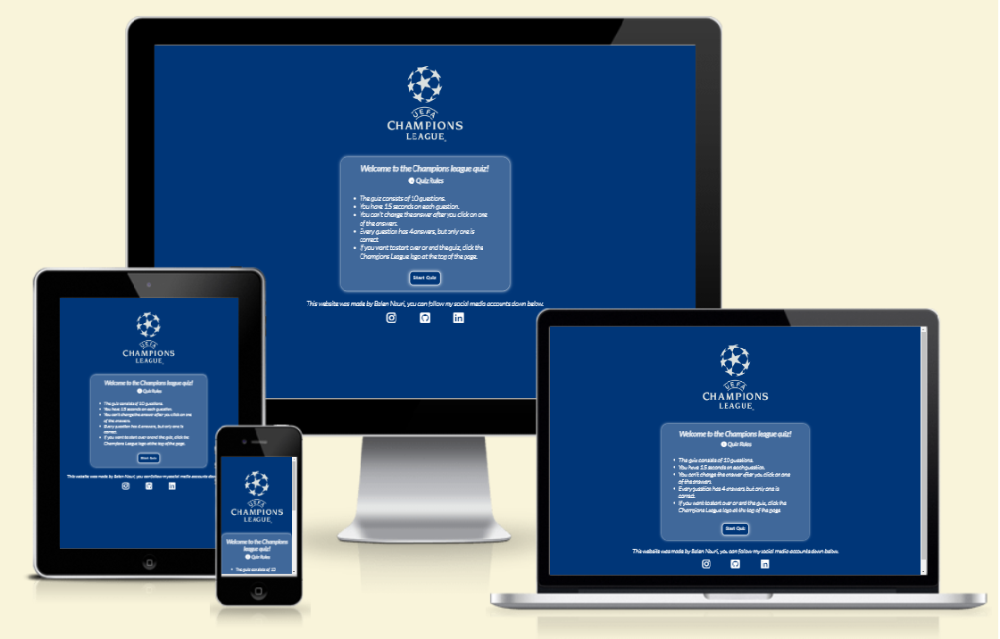

## Table Of Contents

## User Experience Design

### User Demographic

This website is ment for:

### User Stories

As a user of this website:

- Test my knowledge in Champions League with the quiz.
- Be able to start the quiz and see the rules for the quiz.
- See my result after all the questions.
- See the time i have and have left.
- See if i answer correctly or wrong after I chose an answer.
- Be able to restart the game after all the questions.
- Be able to quit the game after the questions or in the middle of the quiz.

## Wireframes

### Desktop

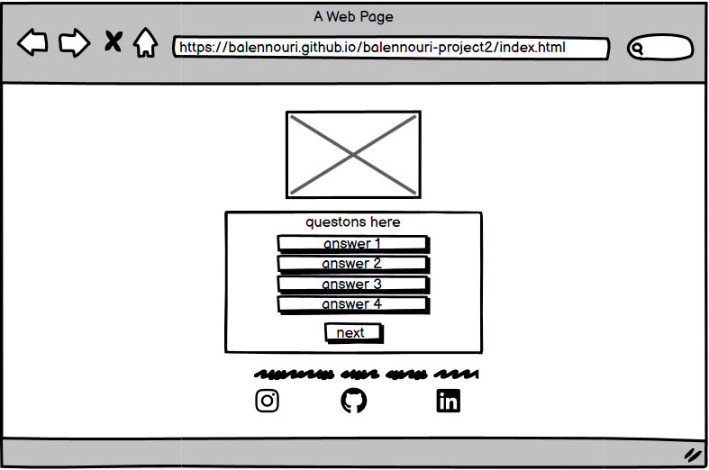

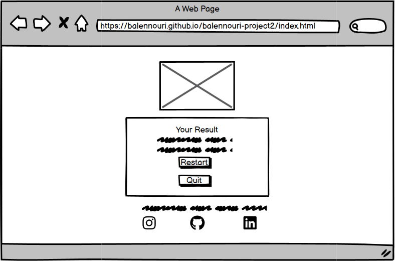

### Mobile

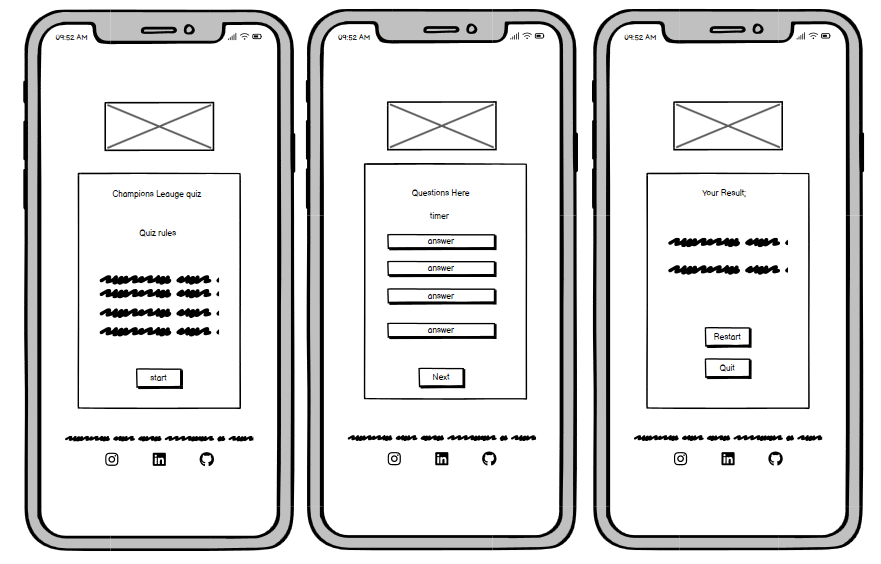

## Design

The website has a clean layout with the Champions League colors and the logo as a header for the website. When you come in on the website you see the logo, the rules for the quiz and the start button. Underneath the game area, in the foot area, you can see my social media links.

### Colours

The colors used for the website were mainly chosen from the colors that the Champions League use. The colors and the logo are very important. When the user jumps on to the website, they will get a feeling of the Champions League because of the right colors and the logo.

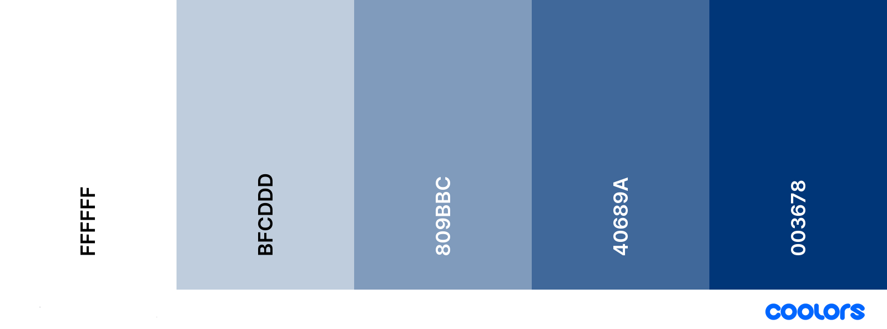

### Typography

Google fonts were used to get the right fonts and all the fonts were imported from there. The font for the heading in the welcome and rules area is a font called Kalnia and for the rest of the content the Lato font is used. In case If the user's browser doesn't read the fonts that are chosen, I put in a second font called Sans-serif for both of them.

## Features

The Champions League website is made up from a single page and it’s hiding the rest of the content depending on what the user is doing.

### Existing Features

### Header

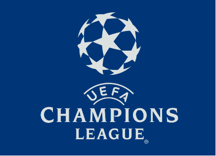

- Featured at the top and center of the page the user will see the header that is the Champions League logo.
- The header is above the welcome section and the game area.
- The header is always visible.
- The header is linked with home page so if user click on the Champions League logo(header) the website will refresh.

### Welcome/Rules section

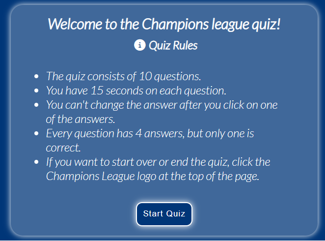

### Quiz area

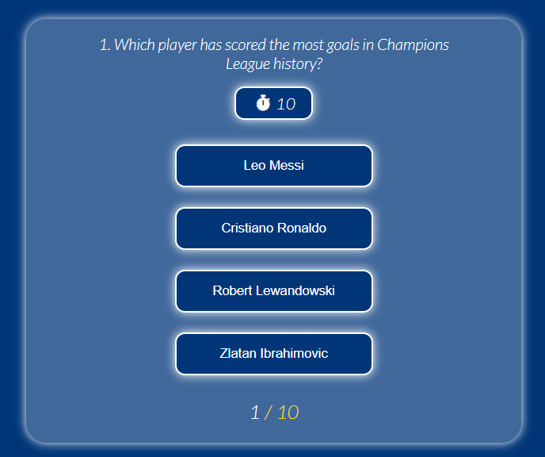

### Result area

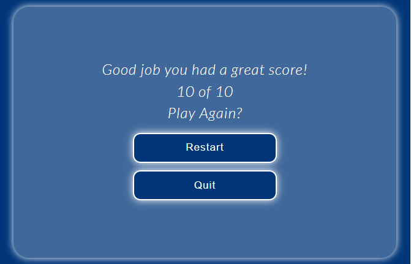

### Social Media Section

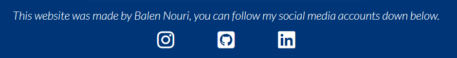

- Underneath the welcome and the game area the user will see the social media icons and who have made the quiz.
- There are three social media icons, Instagram, LinkedIn and GitHub.
- The social media links takes the user to Balen Nouri social media account.
- When the user click on one of the social media icons it will open in a new tab.

## Future Features

Features to be added in the future:

- More questions
- Sound effects when if you answer correctly or incorrectly.
- Navbar with one or two more pages where you can watch Goals and read about the Champions League.

## Technologies Used

### Balsamiq

- Used to design and choose what the page will look like before starting with the coding.

### HTML

- Used to add structure and content to the site.

### CSS

- Used to ads styling to the HTML.

### JavaScript

- Used to add functions to the website, so the user can click on buttons and see effects on the site.

### VS code

- Used to create the code, content for the repository and to push it to GitHub.

### GitHub

- Used to save the repository and deploy the website.

## Testing

### Validator Testing

#### HTML Test

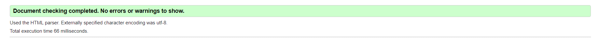

#### CSS Test

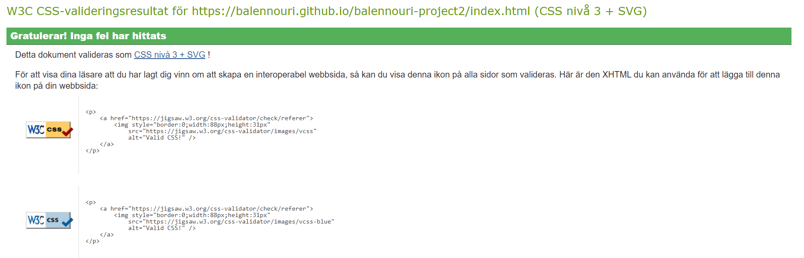

#### JavaScript Test

### Lighthouse Testing

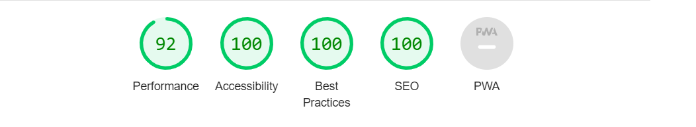

### Known Bugs

#### Resolved

During code validation, these warnings were shown:

##### HTML Warnings

- I missed having a heading in the article element.
- THIS was solved by moving my Quiz Rules heading in to the article element.

#### JavaScript Warnings

- Misseing semicolon on some of the codes
- Solved by adding semicolon to the missing codes.

#### Unfixed Bugs

## Deployment

The website was deployed to GitHub pages. Here is how you deploy on GitHub:

1. In the GitHub repository, click on the setting tab.
2. On the left side under the code and automation section, click on pages.
3. Set branch as main and click save.
4. The website will deploy after a few minutes. The link will be seen at the top of the page.

A live version of the website and the project can be accessed here:
[Uefa Champions Leauge](https://balennouri.github.io/balennouri-project2/index.html)

## Credit

### Content And Code

- The icons used on the social media were taken from [Font Awesome.](https://fontawesome.com)
- The screenshot at the top of the ReadMe was built from [Ami Responsive.](https://ui.dev/amiresponsive)
- The wireframes for the ReadMe were made by [Balsamiq](https://balsamiq.com/)
- I got a lot of my soloutions to my JavaScript file in this youtube [video.](https://www.youtube.com/watch?v=riDzcEQbX6k&t=1282s&ab_channel=WebDevSimplified)

## Logo And Questions

- The Champions Leauge logo did i get from [Cleanpng.](https://www.cleanpng.com/png-201718-uefa-champions-league-2018-uefa-champion-5245771/)
- For the quiz questions, I got them from my own knowledge of football.

## Acknowledgements

This site was developed as my second portfolio project for the Code Institute course in Full Stack Software Development. I would like to thank my mentor David Bowers, the slack community and the Code Institute team.

[Back to top](#uefa-champions-leauge)
